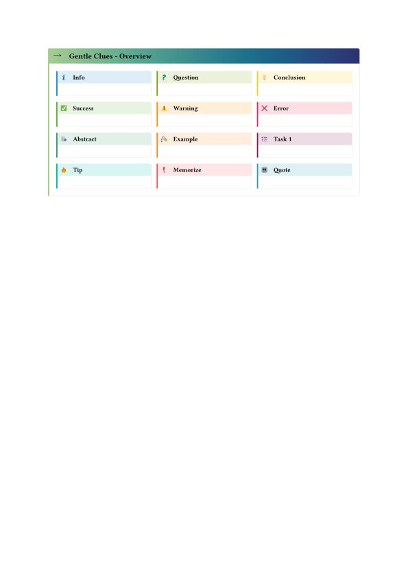

# gentle-clues 

Simple admonitions for typst. Add predefined or define your own. 

Inspired from [mdbook-admonish](https://tommilligan.github.io/mdbook-admonish/).


## Usage

`#import "@preview/gentle-clues:0.5.0": *`

Overview of the predefined clues:



To use the *info* one, it is as easy as writing 
```typst 
    #info[ This is the info clue ... ] 
```


### Change header title language 

You can change the default language for the header titles by 

```typst
  #gc_header-title-lang.update("de")
```
At the moment valid options are: "en","de" and "fr"

### Available Clues

The follwing clues/admonitions (+ some aliases) are available at the moment. `abstract`, `info`, `question`, `memo`, `task`, `idea`, `tip`, `quote`, `success`, `warning`, `error`, `example`.

[See here for more Information](https://github.com/jomaway/typst-admonish/blob/main/docs.pdf)

### Define your own

But it is very easy to define your own. 

```typst 
//When you import the package, include clue
#import "@preview/gentle-clues:0.5.0": clue

//Define it
#let ghost-admon(..args) = clue(
  title: "Buuuuh", 
  _color: gray,
  icon: emoji.ghost, 
  ..args
)
// Use it
#ghost-admon[Huuuuuh.]
```

The icon can be an `emoji`, `symbol` or `.svg`-file. 

### Reference 

Here the full reference to the admonish function.

```typst
clue(
  body,
  title: none, // Default: none, or string
  icon: "assets/flag.svg", // can be a file or an symbol|emoji
  _color: "gray",  // `_` due to naming conflicts with the type color.
  width: auto,
  radius: 2pt, // radius of the right side. For no radius set to 0pt.
  inset: 1em, // inset of the content, header-inset not yet supported
  header-inset: 0.5em, // define header inset.
)
```

## License 

[MIT License](LICENSE)

## Changelog

[See CHANGELOG.md](CHANGELOG.md)